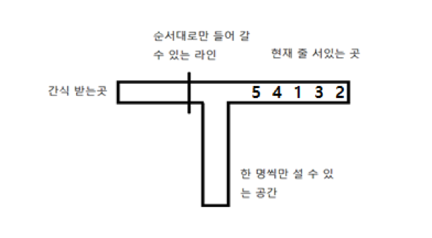
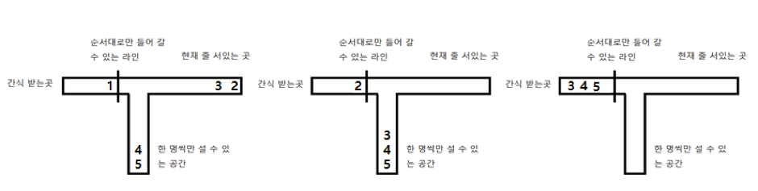

# 문제번호 - 제목
## 문제
인하대학교 학생회에서는 중간, 기말고사 때마다 시험 공부에 지친 학우들을 위해 간식을 나눠주는 간식 드리미 행사를 실시한다. 승환이는 시험 기간이 될 때마다 간식을 받을 생각에 두근두근 설레서 시험 공부에 집중을 못 한다. 이번 중간고사에서도 역시 승환이는 설레는 가슴을 안고 간식을 받기 위해 미리 공지된 장소에 시간 맞춰 도착했다. 그런데 이게 무슨 날벼락인가! 그 곳에는 이미 모든 학생들이 모여있었고, 승환이는 마지막 번호표를 받게 되었다. 설상가상으로 몇몇 양심에 털이 난 학생들이 새치기를 거듭한 끝에 대기열의 순서마저 엉망이 되고 말았다. 간식을 나눠주고 있던 인규는 학우들의 터져 나오는 불만에 번호표 순서로만 간식을 줄 수 있다고 말했다. 

그제야 학생들이 순서대로 줄을 서려고 했지만 공간이 너무 협소해서 마음대로 이동할 수 없었다. 다행히도 대기열의 왼쪽에는 1열로 설 수 있는 공간이 존재하여 이 공간을 잘 이용하면 모두가 순서대로 간식을 받을 수 있을지도 모른다. 자칫 간식을 못 받게 될지도 모른다는 위기감을 느낀 승환이는 자신의 컴퓨터 알고리즘적 지식을 활용해 과연 모든 사람들이 순서대로 간식을 받을 수 있는지 확인하는 프로그램을 만들기로 했다. 만약 불가능 하다면 승환이는 이번 중간고사를 망치게 될 것 이고 가능하다면 힘을 얻어 중간고사를 잘 볼 수 있을지도 모른다.

사람들은 현재 1열로 줄을 서있고, 맨 앞의 사람만 이동이 가능하다. 인규는 번호표 순서대로만 통과할 수 있는 라인을 만들어 두었다. 이 라인과 대기열의 맨 앞 사람 사이에는 한 사람씩 1열이 들어갈 수 있는 공간이 있다. 현재 대기열의 사람들은 이 공간으로 올 수 있지만 반대는 불가능하다. 승환이를 도와 프로그램을 완성하라.

현재 간식 배부 공간을 그림으로 나타내면 다음과 같다.



위 예제는 다음 그림과 같이 움직였을 때 모두가 순서대로 간식을 받을 수 있다..



## 예제 입력
```
5
5 4 1 3 2
```

## 예제 출력
```
Nice
```

## 풀이

### attempt 1

처음에는 next_receiver을 두지 않고 last_received를 두고 while문 안에서 다음 receiver을 판별했었다.

```python
import sys
from collections import deque
n = int(input())
nums = list(map(int, input().split())) # queue, 선입선출
line1 = deque(nums)
line2 = []

last_received = 0
while line1:
    next_receiver = last_received + 1
    if line1[0] == next_receiver:
        last_received = line1.popleft()
    else:
        line2.append(line1.popleft())

    while line2:
        if line2[-1] == next_receiver:
            last_received = line2.pop()
        else:
            break

if len(line2) == 0:
    print('Nice')
else:
    print('Sad')

```
반례가 뭔지는 모르겠는데, 일단 틀렸다.
답과 내가 제출한 코드의 차이점은 인덱스 증가문을 while루프의 끝단에 위치했다는 것이다.


```python
import sys
from collections import deque
n = int(input())
nums = list(map(int, input().split())) # queue, 선입선출
line1 = deque(nums)
line2 = []

next_receiver = 1
while line1:
    if line1[0] == next_receiver:
        last_received = line1.popleft()
        next_receiver += 1
    else:
        line2.append(line1.popleft())

    while line2:
        if line2[-1] == next_receiver:
            last_received = line2.pop()
            next_receiver += 1
        else:
            break

if len(line2) == 0:
    print('Nice')
else:
    print('Sad')

```
